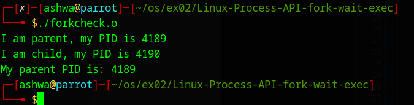
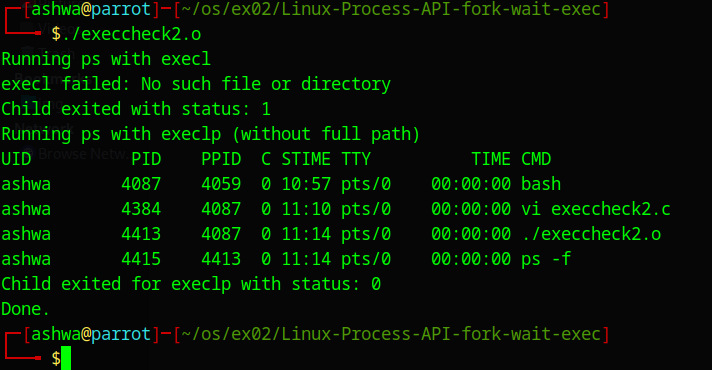

# Linux-Process-API-fork-wait-exec-
Ex02-Linux Process API-fork(), wait(), exec()
# Ex02-OS-Linux-Process API - fork(), wait(), exec()
Operating systems Lab exercise


# AIM:
To write C Program that uses Linux Process API - fork(), wait(), exec()

# DESIGN STEPS:

### Step 1:

Navigate to any Linux environment installed on the system or installed inside a virtual environment like virtual box/vmware or online linux JSLinux (https://bellard.org/jslinux/vm.html?url=alpine-x86.cfg&mem=192) or docker.

### Step 2:

Write the C Program using Linux Process API - fork(), wait(), exec()

### Step 3:

Test the C Program for the desired output. 

# PROGRAM:

## C Program to create new process using Linux API system calls fork() and getpid() , getppid() and to print process ID and parent Process ID using Linux API system calls

```
#include <stdio.h>
#include <stdlib.h>
#include <unistd.h>
#include <sys/wait.h>   // for wait()

int main() {
    int pid = fork();   // Create a new process

    if (pid == 0) { 
        // Child process
        printf("I am child, my PID is %d\n", getpid()); 
        printf("My parent PID is: %d\n", getppid()); 
        sleep(2);  // Keep child alive for verification
        exit(0);   // Child exits
    } 
    else if (pid > 0) { 
        // Parent process
        printf("I am parent, my PID is %d\n", getpid()); 
        wait(NULL);   // Wait for child to finish
        printf("Child process has finished.\n");
        exit(0);      // Parent exits
    } 
    else {
        // Error case
        perror("fork failed");
        exit(1);
    }
}

```


##OUTPUT




## C Program to execute Linux system commands using Linux API system calls exec() , exit() , wait() family

```
//C Program to execute Linux system commands using Linux API system calls exec() family
#include <stdio.h>
#include <stdlib.h>
#include <sys/types.h>
#include <sys/wait.h>
#include <unistd.h>

int main() {
    int status;
    
    printf("Running ps with execl\n");
    if (fork() == 0) {
        execl("ps", "ps", "-f", NULL);
        perror("execl failed");
        exit(1);
    }
    wait(&status);
    
    if (WIFEXITED(status)) {
        printf("Child exited with status: %d\n", WEXITSTATUS(status));
    } else {
        printf("Child did not exit successfully\n");
    }
    
    printf("Running ps with execlp (without full path)\n");
    if (fork() == 0) {
        execlp("ps", "ps", "-f", NULL);
        perror("execlp failed");
        exit(1);
    }
    wait(&status);
    
    if (WIFEXITED(status)) {
        printf("Child exited for execlp with status: %d\n", WEXITSTATUS(status));
    } else {
        printf("Child did not exit successfully\n");
    }
    
    printf("Done.\n");
    return 0;
}

```


##OUTPUT




# RESULT:
Thus the program to implement the creation of a process using fork(), exec(), exit() , wait() API is written and verified using C programming.